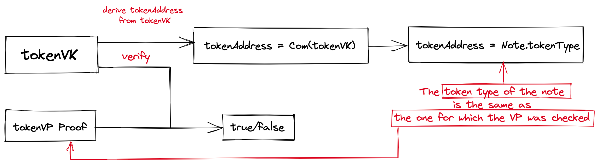
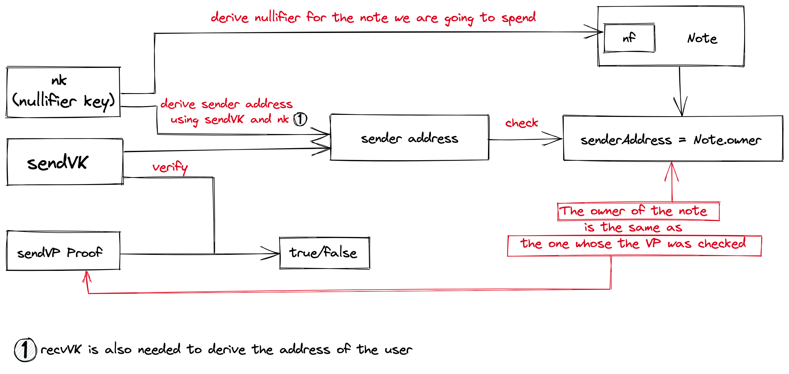
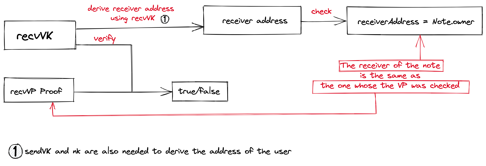
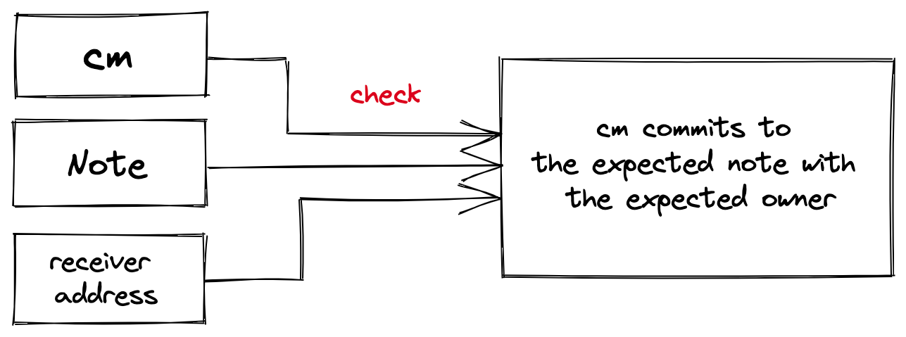

# Action

`Action` is a mechanism that allows a user to spend or create [notes]() by proving the right to do so using ZK proofs.
## Spend a note

To spend a note, the user needs to prove that they are allowed to do so, namely:
- to make sure that the correct `tokenVP` is checked, prove the relationship between `tokenVP` and token field in the note 
  
  
- to make sure the correct `sendVP`(read more about `sendVP` [here](./validity-predicates.md)) is checked, prove the relationship between sendVP and owner field in the note
- to make sure that the nullifier is correct, prove the relationship between `nf`, the note, and the owner 

## Create a note

To create a note, the user also needs to prove the right to do so. TokenVP must allow the creation of the note, as well as the receiver's VP `recvVP`:

- to make sure that the correct `tokenVP` is checked, prove the relationship between `tokenVP` and token field in the note to be created
  

- to make sure the correct `recvVP`is checked (read more about `recvVP` [here](./validity-predicates.md)), prove the relationship between recvVP and the owner of the note to be created
  
  
- to make sure that the [note commitment](./notes.md) `cm` is derived correctly, prove the relationship between `cm`, the note, and the receiver of the note

To ensure full privacy, we use [blinding](./blinding.md) to hide VPs.
To see more detailed description of Action circuit checks, see [here](./spec.md).