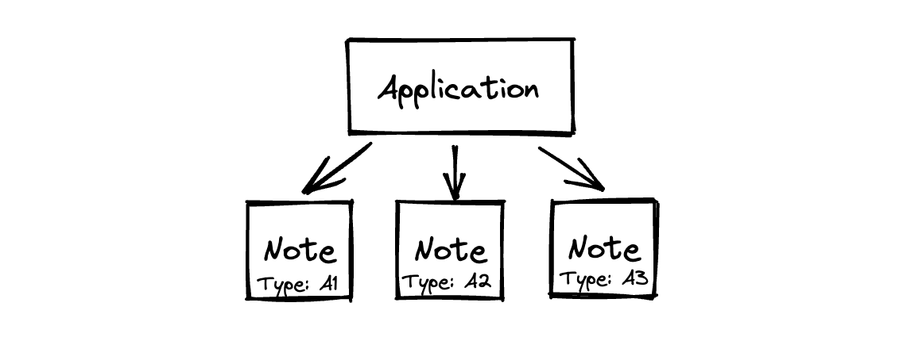

# Application

### Application logic
Application VP is the defining structure of an application that contains the application logic. 
Every time the application state is about to change, the application VP is called to validate the state transition.
If the application VP doesn't consider a state transition valid, the state will not be changed.

An application VP might require validity of other VPs, enforcing the VP hierarchy with the application VP being the main VP checked.

#### Application address
Each application has an address that identifies the application. The application address is derived from its application VP (or VPs, if there is more than one).

### Application state
As Taiga works in the UTXO model, application states are stored in notes, and changing the application state is done by spending the old application state notes and creating new application state notes.

The application a note belongs to is indicated by the note's type which is derived using the application address, binding the note with the application.
One application can have notes of multiple types, all of which are derived using the application address and some additional information that helps to distinguish the application types.
Notes of distinct types are independent of each other, unless explicitly designed.

#### Shielded applications
All applications in Taiga are shielded, which means that the application VP of each application is hidden, the notes containing application states are encrypted, 
and the produced transactions don't reveal any information about the applications they change the state of. 

#### Are Taiga applications similar to Ethereum applications?

In some sense, Taiga applications are similar to Ethereum applications, but there are two key distinctions that come to mind:
* Ethereum uses smart contracts when Taiga uses validity predicates to describe the application logic (learn more about the difference [here](https://github.com/anoma/whitepaper/blob/main/whitepaper.pdf), page 3)
* Taiga applications are shielded by default, but can be defined separately over the transparent pool as well. The shielded and transparent parts of the application can interact with each other, but whatever happens in Taiga is always shielded

