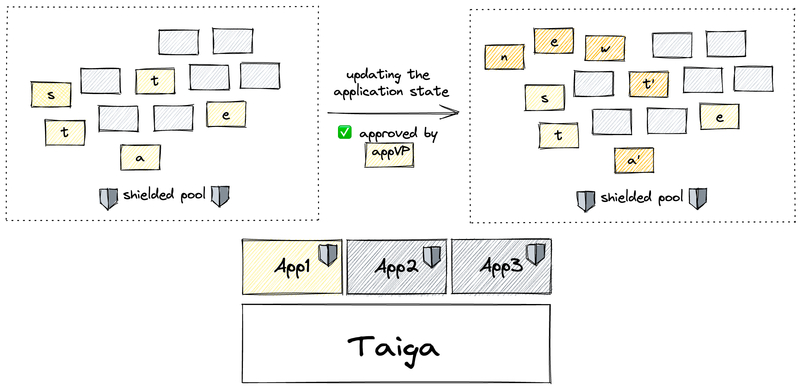

# Application

In Taiga, applications express their logic in validity predicates (often referred as `appVP`) that are checked each time the application's state is about to be changed. 
So, if a suggested state transition breaks the application rules, the `appVP` of that application won't approve the transaction. 

As Taiga works in the UTXO model, application states are stored in notes, and changing the application state is done by spending old application state notes and creating new application state notes.

Applications in Taiga are shielded, which means that the `appVP` of each application is hidden, the notes containing application states are encrypted, 
and the produced transactions don't reveal any information about the applications they change the state of. 

#### Is it like Ethereum?

In some sense, Taiga applications are similar to Ethereum applications, but there are two key distinctions that come to mind:
* Ethereum uses smart contracts (imperative) when Taiga uses validity predicates (declarative) to express the application logic (learn more about the difference in the [Anoma whitepaper](https://github.com/anoma/whitepaper/blob/main/whitepaper.pdf), check page 3)
* Taiga applications are shielded by default, but can be defined separately over the transparent pool as well. The shielded and transparent parts of the application can interact with each other, but whatever happens in Taiga is always shielded

### Application VP
Each application has an [`appVP`](./validity-predicates.md) that defines the conditions on which the application can be used (i.e. the application notes can be sent or received). Every time a note that belongs to the application is spent or created, `appVP` is called to authorize the transaction.

`AppVP` might also require validity of other VPs, enforcing a VP hierarchy with an `appVP` being the main VP checked. This might be userful, for example, when an application has users and allows them to express their interests by supporting user-defined validity predicates. In that case, the application is responsible for making sure the users' interests are satisfied - Taiga is agnostic of sub-VPs.

#### Application notes
The application a note belongs to is indicated by the note's type. The note type is derived using the application address, that is itself derived from the application VP. 
The note type might be further specified so that an application can have notes of multiple types all of which belong to the same application. 
Notes of distinct types are independent of each other, unless explicitly designed.

#-- example

The simplest application could be a cryptoasset application CRY with the `appVP` that makes sure that the transaction is balanced.
