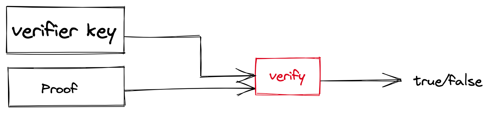
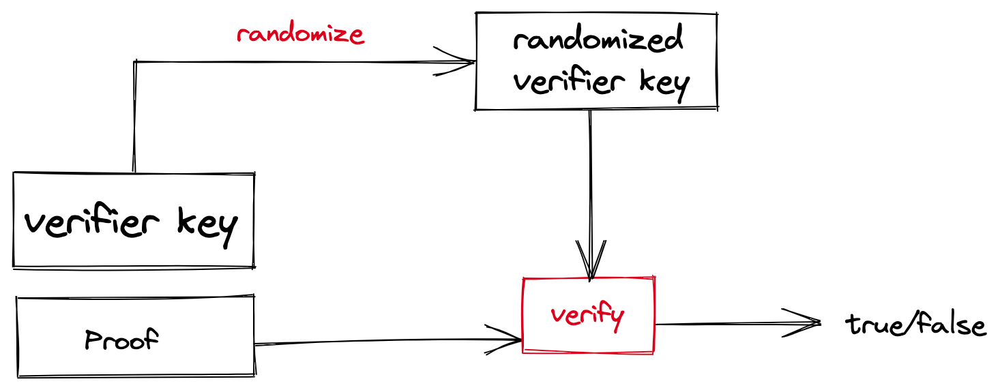
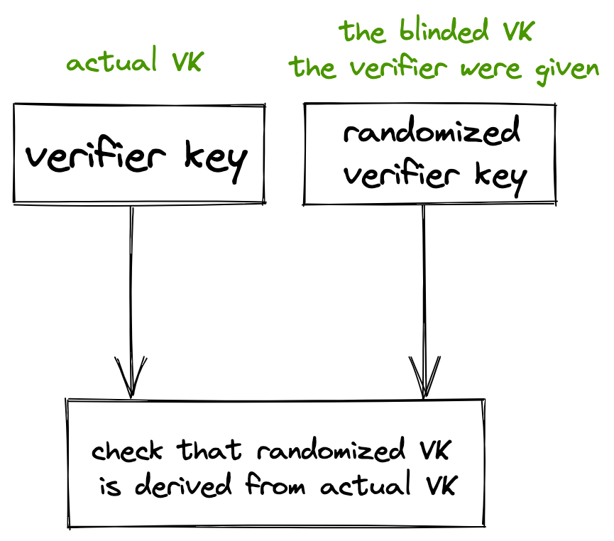

# Blinding

In the [previous section](./action.md), we explained how we bind the different proofs to the spent and created notes. In this section, we focus on the privacy of the verifier keys of these proofs.

Validity predicates are customizable by users and tokens. Moreover, the verifier keys are computed from the circuits and are visible by all the verifiers of the proof. These verifier keys are private information that leak privacy and need to be protected.


In order to get full privacy, we blind (or randomize) the verifier keys so that a proof can be checked against a verifier key or its blinded (randomized) version.



In this way, a verifier does not require the private verifier key to check the proof and can check the proof against the blinded vk. Though, this verifier needs a proof that the blinded verifier key they were given comes from the actual verifier key.



The blinding technique is used to protect `send_VK`, `recv_VK`, and `token_VK`.
This blinding is done for user's `send_VK` and `recv_VK` as well as for `token_VK`.

## Example of blinding proof
First, we create a blinding circuit structure including the random values used for blinding:
```rust
let mut blinding_circuit =
      BlindingCircuit::<CP>::new(&mut rng, vp_desc, &pp, vp.padded_circuit_size()).unwrap();
```
As for `SendVP`, `RecvVP` and `TokVP` proofs, we need a setup and prover/verifier keys:
```rust
let (pk_blind, vk_blind) = vp
      .compile_with_blinding::<PC>(&pp, &blinding_circuit.get_blinding())
      .unwrap();
let pp_blind = Opc::setup(blinding_circuit.padded_circuit_size(), None, &mut rng).unwrap();
```
From that, we can generate the blinding proof. Note that this is a bit expensive in practice:
```rust
let (proof, public_inputs) = blinding_circuit
      .gen_proof::<Opc>(&pp_blind, pk, b"Test")
      .unwrap();
```
From a proof, the verifier can check the public inputs against the blinded verifier key `vk_blind` (see [here](https://github.com/anoma/taiga/blob/main/src/doc_examples/blinding.rs)), and verifiy the proof:
```rust
let verifier_data = VerifierData::new(vk, public_inputs);
verify_proof::<Fq, OP, Opc>(
    &pp_blind,
    verifier_data.key,
    &proof,
    &verifier_data.pi,
    b"Test",
)
.unwrap();
```

Next: [transaction](./transaction.md)
