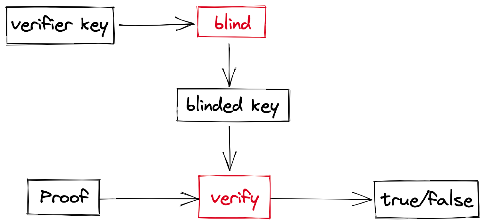
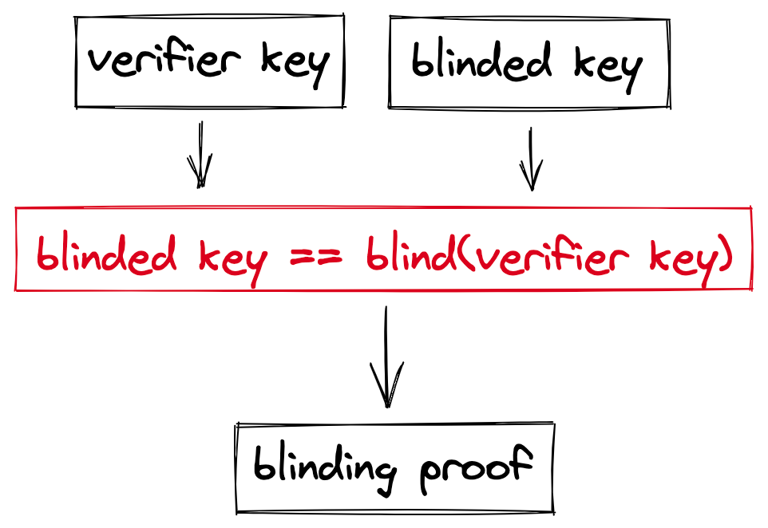

# Blinding

To verify a proof, a user needs something called **verifier key**. Verifier key is derived from the circuit and whoever has this key can verify the proof.

However, verifier key leaks some information about the circuit which we don't want to reveal, so we use blinding to protect the key. 

To blind the verifier key, we add to it some random data that vanishes at the right moment (thanks to the math). Using randomized verifier keys helps to hide the actual verifier key and break the link between the usages.

To make sure that the blinded key corresponds to the actual verifier key, the correctness of the blinding must be proven and verified.
