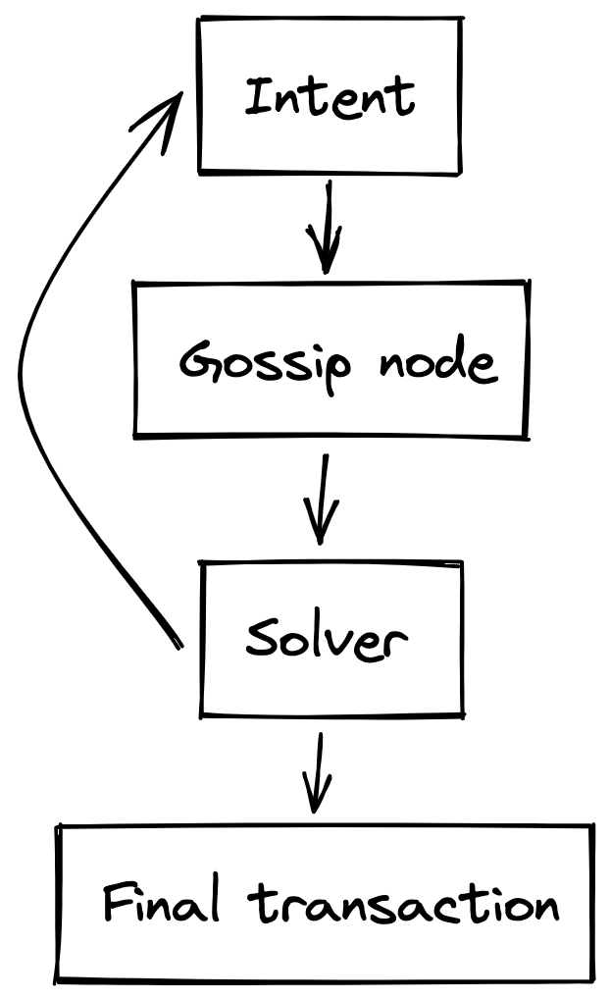

## On a high level
Users use intents when they want to enact a multiparty state transition. High level description of the flow:
1. **Create**: User creates an intent publishing the information of what they have and what they want to get in exchange
2. **Gossip**: The intent goes to the intent gossip network and gossiped around the solver nodes.
3. **Solve**: Solvers find matching intents and update the intent until it is fully satisfied
4. **Finalize**: When the intent is satisfied, a transaction is created and published on the blockchain

### Create an intent
User intents can be seen as partial transactions. Users send them to the intent gossip network and solvers match them in order to create full transactions and publish them on the blockchain. That implies that users need to give some information to the solvers that is sufficient to create the final transaction (proofs). To make sure that users reveal the minimal amount of private infortmation that is still enough to create the transaction, users create **intermediate notes** from the notes they are willing to spend.

#### Intermediate notes
An intermediate note is a note with a simplified sending VP. This VP is specific to the intent and includes only the rules from the userVP that are governing the specific state transition (e.g. if Alice wants to trade A for B, she sends her asset A to a temporary intent-specific VP that allows to send A to anyone who sends Alice B). All of the note fields stay the same except:
- sending VP -> intent-specific VP
- owner address -> intent-specific owner address (sending VP is used to calculate the owner address, so different VPs correspond to different owner addresses)

The creation of the intermediate note can be seen as sending a note to a new address with intent-specific VP.

**Note**: as the *nullifier key* **nk** is also used to calculate the address, so the VP doesn't solely define the address

**Note**: The content of intent-specific VPs in known to the solver because the solver will create the final transaction and some of the proofs

### Solve
We are considering the model when a solver makes one step at a time and sends the result to the next solver. In practice, the solver can send the result to themselves and continue solving if they have the intent to make the next step. It would be nice to merge the steps into one when possible, but for simplicity we ignore this detail here

**Note**: each solver must check the proofs they receive from other nodes

When a solver has two intents that can be matched together, they match the intents by spending the old notes and creating new notes. Solvers have the authority to spend and create the intermediate notes they receive and produce the proofs required to perform the action. Solvers also know the content of intent-specific VPs and receving VPs of the users (necessary to be able to satisfy them). Solvers don't know the identities of the users. Created notes are added in a local MT tree that will be published later along with the settled transaction.

If a solver has two intents that can be matched together, two cases are possible:
1. The match is partial, partial transaction and a new intent are created. In this case the solver appends the data they produced to the new intent and gossips the new intent to the next node
2. The match is final, the solver publishes the final transaction as described below

In the current implementation we assume a simpler model where only one solver can match n-party bartering intents (no partial solving).

**Note**: solvers don't need to be identified as all actions are authorized by user/app VPs. However, if they want to receive fees, they need to have an address on the chain.

### Publishing partial transactions

Publishing partial transactions on the blockchain shouldn't be possible. 

If intermediate notes have a completely different type from normal notes, this isn't a problem as the correct transaction should only contain notes of the right type. 

If intermediate notes have the same type as normal notes and only differ in the purpose of existence, this could be a problem (although in the simplified setting without partial solving it wouldn't be)

### Finalize

After the intents are matched with satisfaction of all involved parties, the transaction is published on the blockchain. The intermediate notes themself are not published, but the local CMTree is, as well as all of the proofs created (including the proofs for the intermediate notes).

### Example with a 3-party bartering cycle

On the example below Alice, Bob, and Carol want to exchange some assets (not necessarily with each other). 

1. All three of the users create intermediate notes with intent-specific VPs.

2. Alice and Bob create their intents and send them to the intent gossip network. 
   
2.1 Carol creates her intent and sends it to the intent gossip network.

3. The first solver receives the intents of Alice and Bob (but not necessarily Carol's), matches them, and produces a partial tx. This partial transaction satisfies the needs of Alice but not Bob's and cannot be finalized. Solver produces a new intent (seeking for the resources to satisfy Bob's VP).

4. The second solver receives the intent produced by the first solver and Carol's intent and matches them. The resulting transaction satisfies the needs of Alice, Bob, and Carol and can be finalized.

5. The final transaction doesn't contain intermediate notes, but contains commitments to them. In the end, Alice sends her note to Carol, Carol sends her note to Bob, and Bob sends her note Alice.

