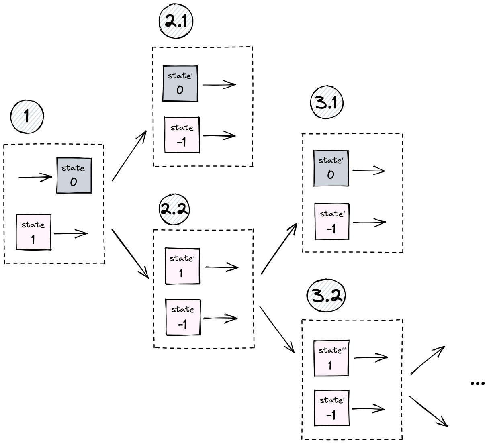

# Taiga execution model

## On a high level
Intents are a mechanism that allows users to enact a multiparty state transition. High level description of the flow:
1. **Create**: A user creates an intent publishing the information of what they have and what they want
2. **Gossip**: The intent goes to the intent gossip network and is gossiped around the solver nodes
3. **Solve**: Solvers find matching intents and update the intent with partial transactions until the intent is fully satisfied
4. **Finalize**: When the intent is satisfied, a transaction is created and published on the blockchain

## Step 1: Create an intent

Intents specify ephemeral interests of users. This step consists of two parts:
1. **Specify an intent**. `IntentVP` encodes the needs of the user and enforces their satisfaction
2. **Create the initial partial transaction** 

**Note**: For simplicity we assume that an intent includes the user sending notes and receving notes.

### Partial transaction

Two of the main requirements for an Anoma transaction to be valid are: 
1. VPs of all involved parties must be satisfied
2. The transaction must be balanced i.e the value spent = the value output for all involved token types

We call a **partial transaction** a state transition where the first requirement is satisfied (all VPs evaluate to True), but the second one isn't (the state transition is unbalanced). Such a state transition isn't a valid transaction and cannot be published on the blockchain, 
but can be combined with other partial transactions in order to build a valid [balanced] transaction. 

Partial transactions are immutable objects, and once they are created, they cannot be changed. 
In principle, any party can create a partial transaction, if they can prove that the VPs of the parties involved in the partial transaction are satisfied. Some of the common examples would be **solvers** who match intents and create transactions, and users who spend and create some notes as a part of creating an intent. In the initial partial transaction the user spends the assets they were willing to spend as a part of the intent and outputs an **intent token note**.

### Intent tokens

To make sure that the user's intent is satisfied, we use **intent tokens**. Intent token notes are a special type of notes that cannot be spent, only created. In addition, intent notes can have negative value.

How to use intent tokens:
1. Spending their notes in the initial partial transaction, the user additionally spends an intent token note of value [1].
2. The other intent token note of value [-1] balancing this token will only be created if the user's intent (intentVP) is satisfied.
3. Once all of the parties involved in a state transition create their [-1] intent token notes (meaning that the intents of all of them are satisfied), the transaction is balanced and can be finalized.

If we look at the notes as messages passing from one user (application) to another, the first [1] intent note can signal a message being sent, when the [-1] note will signal that the message has been received. See more about the idea of message passing [here](./message_passing.md).

**Note**: instead of using notes of negative value the user can instead spend a [1] intent token note (that hasn't been created before) in their initial partial transaction. Once the user's intent is satisfied, a [1] intent note will be output balancing the initial spend.

**Note**: intent token notes are not committed to in the global CMtree

## Step 2: Gossip
Once intentVP is specified and the initial partial transaction is created, the user sends the intent to the intent gossip network and solvers match intents in order to create full transactions and publish them on the blockchain. That implies that users need to give some information to the solvers (including the content of `intentVP`) that is sufficient to create partial transactions and transactions (proofs)

To Do: what is the minimal amount of information needs to be revealed to the solver in order to match a transaction?

## Step 3: Solve
We are considering the model when a solver makes one step at a time and sends the step result to the next solver. In practice, the solver can send the result to themselves and continue solving if they have the intent to make the next step. It would be nice to merge the steps into one when possible, but for simplicity we ignore this detail here

### Create partial transactions

When a solver has two intents that can be [partially] matched together, they [partially] match the intents by creating new partial transactions. The intentVPs or other partial transactions are not modified.

#### Prove
Solvers are responsible for creation of all proofs (`Action`, `tokenVP`, etc) required for a state transition for their partial solutions.
- solvers **have the authority** to spend and create the notes they receive and produce the proofs required to perform the action
- solvers **know** the content of intentVPs of the users (necessary to be able to satisfy them)
- solvers **don't know** the identities of the users

When solvers receive partial transactions, they must check all of the proofs attached to them.

#### Local `cm` trees

To store note commitments `cm`, a local commitment tree `CMtree` is created. After the transaction is finalized, the tree will be published on the blockchain along with the transaction.

### Partial vs final match

After the solver matches the intents, two cases are possible:
1. At least one of the total per-token balances computed by summing up the per-token balances of partial transactions is a non-zero value. The solver sends the data to the next solver
2. All total per-token balances are equal to 0. A valid transaction can be created and published

**Note**: in the current implementation we assume a simpler model where only one solver can match n-party bartering intents (**no partial solving**).

**Note**: solvers don't need to be identified as all actions are authorized by user/app VPs. However, if they want to receive fees, they need to have an address on the chain.

## Step 4: Finalize

After the intents are matched with satisfaction of all involved parties, the transaction is published on the blockchain. The local CMTree and all of the proofs created are published on the blockchain.

## Examples

### Three-party barter

On the diagram below you can see an example of three-party bartering cycle in the execution model described in this document.

**Step 1-2**: The users (Alice, Bob, and Charlie) define their intents and create intentVPs. It doesn't have to happen at the same time for all users, but for simplicity we describe it as one step. The intentVPs of all three users have the same structure: users are willing to spend their asset (Alice - a star, Bob - a dolphin, Charlie - a tree) in exchange for some other asset. Once the user receives the desired asset, an intent token note of value [-1] is emitted. In addition to that, all three users also create their initial partial transactions spending the asset they are ready to give away (Alice ptx, Bob ptx, and Charlie ptx).

**Step 3**: A solver sees Alice's ptx and Bob's ptx, matches them together, and creates a new partial transaction. Alice's intentVP is satisfied, [-1] intent token note is created. 

Total per-token balances:
|token|spent|output|spent - output|
|-|-|-|-|
|star NFT|1|0|1|
|blue dolphin NFT|1|1||
|blue intent token|[1] + [-1]|-|0|
|yellow intent token|[1] |-|[1]|

**Step 4**: A solver sees all previous partial transactions and the initial transaction created by Charlie. The solver matches them together and creates new partial transactions, sending the tree to Bob and the star to Charlie. VPs of Bob and Charlie are now satisfied, the corresponding notes of value [-1] are created. The  per-token balance of partial transactions is equal to zero, which means it is possible to create a transaction.
Total per-token balances:
|token|spent|output|spent - output|
|-|-|-|-|
|star NFT|1|1|0|
|blue dolphin NFT|1|1|0|
|blue intent token|[1] + [-1] = [0]|-|0|
|yellow intent token|[1] + [-1]|-|0|
|tree NFT|1|1|0|
|green intent token|[1]+ [-1]|-|0|

**Step 5**:
The final transaction containing the spent and output notes from partial transactions is created. All proofs are attached.

### Complex intentVP

Let's consider a situation where one of the parties has a more complex VP. Here Alice has two notes: [1] of token A and [2] of token B and wants to get a blue dolphin NFT in  exchange for one of them and get the other one back. Bob has a simple intentVP as in the example above.

**Step 1-2**: Alice and Bob define their intents and create their intentVPs. They create their initial partial transactions. Alice spends both of the notes she is ready to give away, expecting to receive one of them back (and the other one goes to the former blue dolphin NFT owner).

**Step 3**: A solver sees Alice's and Bob's partial transactions and matches them together, creating new partial transactions. Alice receives the blue dolphin NFT and one of her notes ([1] of A) back, her intentVP is satisfied and the [-1] note of Alice's intent token is released. Bob get's [2]B note from Alice, his intentVP is satisfied, [-1] intent token note is released. All total per-token balances are equal to 0, and the final transaction can be created.

**Step 4**: The final transaction is created from the spent and output notes from the partial transactions. All proofs are attached.

### One way to represent arbitrary states

For arbitrary application, notes store the state of the application. When the application needs to change its state, it (anyone who has the authority) can spend the old state and produce a new state.
If the state change is possible within one partial transaction, such a note has a value 0 and doesn't affect the total balance.

If the state change happens across partial transactions (meaning that the state gets consumed in one partial transaction and a new state is output in another), the process is a bit different. 

#### State transition across partial transactions

For simplicity, let's assume that the old state note has a 0 value. A zero-value note doesn't affect the total balance which is necessary for across-ptx communication. And so the first step is to turn a zero-value note into a non-zero value note (step 1 on the diagram).

In the next partial transaction (step 2) we output [-1] value note to balance the old [1] state note, but if the state can be changed to final in the next partial transaction (step 2.1), a new state zero-value note is produced, total balance becomes zero, and the transaction can be finalized. If the state isn't final (step 2.2), another [1] value note with the new (but not final) state is produced, the total balance is non-zero and the transaction cannot be finalized. In that case, the step 2 is repeated until the final state is computed

**Note**: different states imply different token types, and the old state note cannot balance a new state note