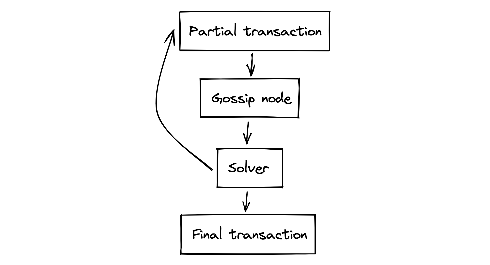
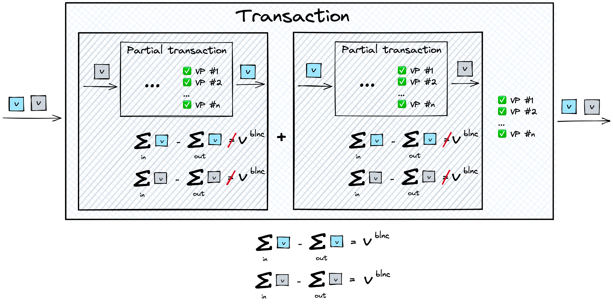

# Taiga execution model
## On a high level
Taiga's execution model relies on the ideas of intents and solvers. 
Users express their interests and provide the resources to the solvers, and Taiga makes sure that the intents are satisfied atomically.

Here is the high level description of the process, starting from expressing the user's preferences and ending up publishing a blockchain transaction representing the desired state transition:
1. **Specify**: A user publishes the information of what they have and what they want
2. **Gossip**: The user's data goes to the gossip network and is gossiped around the solver nodes
3. **Solve**: Solvers find matching partial transactions and add new partial transactions until the interests of all parties are fully satisfied
4. **Finalize**: When all parties are satisfied, a transaction is created and published on the blockchain

## Step 1: Specify interests

The user creates the initial partial transaction to provide the resources for the solvers 
by spending the notes that they are ready to give up and creating some notes to indicate what they want to receive in return.

### Partial transaction

Two of the main requirements for an Anoma transaction to be valid are: 
1. VPs of all involved in the transaction parties must be satisfied.
2. The transaction must be **balanced** , i.e the value spent in the transaction minus the value output equals to some predefined value `v`, the **balancing value**. 
   The balancing value is transparent (visible to external observers) and can be involved in interactions with the transparent system.

We call a **partial transaction** a state transition for which all VPs evaluate to True, but the state transition is unbalanced. 
Such a state transition isn't a valid transaction and cannot be published on the blockchain, 
but can be combined with other partial transactions in order to build a valid transaction. 

Partial transactions are immutable objects, and once they are created, they cannot be changed. 
In principle, any party can create a partial transaction, 
if they can prove that the VPs of the parties involved in the partial transaction are satisfied. 

**Initial partial transactions** are the partial transactions that users create at the beginning, 
providing the resources for the state transition.

**Note**: For simplicity we assume that users want to both send and receive notes.

### Message passing
If we look at the notes as messages passing from one user (application) to another, the output notes can signal a message being sent, and spending of that note will signal that the message has been received. 
See more about the idea of message passing [here](message_passing.md).

## Step 2: Gossip
Once the initial partial transaction is created, the user sends it to the gossip network. 
Gossip nodes send those partial transactions to each other, spreading them around. 
Solvers listen to the gossip network and collect the partial transactions to match them together.

## Step 3: Solve

Solvers receive partial transactions from the gossip network and match them together in order to create transactions. 

That implies that users need to give some information to the solvers that is sufficient to create partial transactions and transactions (to create proofs). 
In order to create a transaction, the solver needs to know:
- what matching parties want
- note commitments and nullifiers from prior partial transactions (to be chained)
- proofs from prior partial transactions (to be chained)
- for the notes spent/output in the new partial transaction: nullifier key, commitments to the sender/receiver VPs, note fields

We are considering the model where a solver makes one step at a time and sends the step result back to the gossip network, 
where the partial solution meets the next solver in the chain. 
In practice, the solver can continue solving instead of sending the result back to the gossip network if they can make the next step.

### Create partial transactions

When a solver has partial transactions that can be matched together, they match them by adding new partial transactions to the match.
Solvers cannot modify the old data, only create new.

#### Prove
Solvers are responsible for creation of all proofs (`Action`, `VP`, etc) required for their partial solutions. For that reason, solvers:
- **have the authority** to spend and create the notes they receive and produce the proofs required to perform the action,
- **know** the content of the VPs of the users (if there are any) to be able to satisfy them,
- **don't know** the identities of the users.

When solvers receive partial solutions from the gossip network, they must check all of the proofs attached to them.

### Partial vs final match

After the solver matches the notes, two cases are possible:
1. At least one of the total per-token balances computed by summing up the per-token balances of partial transactions doesn't equal the balancing value. In this case, the solver sends the data to the gossip network.
2. All total per-token balances are equal to the balancing values. A valid transaction can be created and published.

**Note**: in the current implementation we assume a simpler model with no partial solving.

**Note**: solvers don't need to be identified as all actions are authorized by VPs. 
However, if they want to receive fees, they need to have an address on the chain.

## Step 4: Finalize

When all involved parties are satisfied the transaction can be published on the blockchain. 
A created transaction contains information about the proposed state transition to be stored on the blockchain:
- spent notes' nullifiers
- output notes' commitments
- VP proofs required by each involved application
- Action circuit proofs
- and some additional data
  
# How to express the preferences

A user can express their preferences in two ways. 

When a user knows what they want, they can directly create the notes that they want for themselves, 
and the counterparty will have to spend the notes that the user has created, balancing the transaction. 
Such approach works well when a party knows exactly what they want, 
but if a user can be satisfied with multiple possible state transitions, such approach wouldn't work well.
In that case, they can use the help of the [intent application](./intent.md). 
