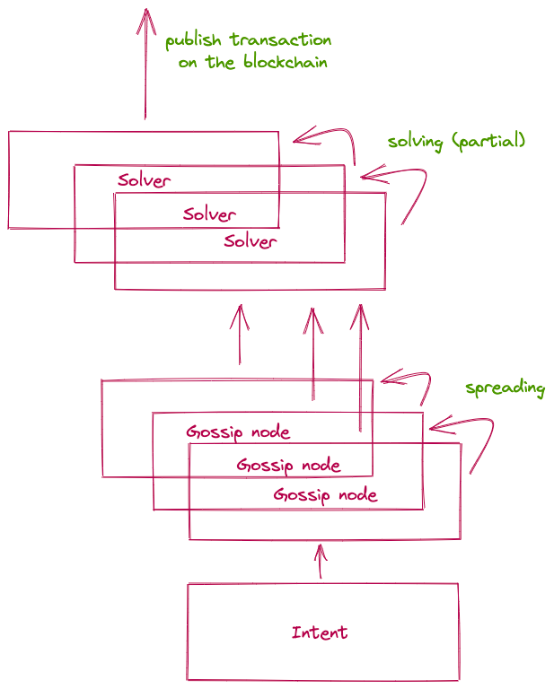
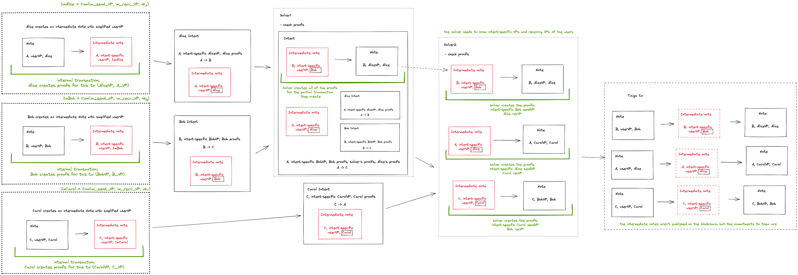

## On a high level
Users use intents when they want to exchange their assets for some other asset. High level description of the flow:
1. **Create**: User creates an intent publishing the information of what they have and what they want to get in exchange
2. **Gossip**: The intent goes to the intent gossip network and gossiped around the solver nodes.
3. **Solve**: Solvers find matching intents and update the intent until it is fully satisfied
4. **Finalize**: When the intent is satisfied, a transaction is created and published on the blockchain

### Create an intent
User intents can be seen as partial transactions. Users send them to the intent gossip network and solvers match them in order to create full transactions and publish them on the blockchain. That implies that users need to give some information to the solvers that is sufficient to create the final transaction (proofs). To make sure that users reveal the minimal amount of private infortmation that is still enough to create the transaction, users create **intermediate notes** from the notes they are willing to spend.

#### Intermediate notes
An intermediate note is a note with a simplified sending VP. This VP is specific to the intent and contains only the rules that are necessary to satisfy for the transaction to happen. All of the note fields stay the same except:
- sending VP -> intept-specific VP
- owner address -> intent-specific owner address (sending VP is used to calculate the owner address, so changing the VP implies the change of the owner address)

The creation of the intermediate note can be seen as sending a note to a new address with intent-specific VP.

Note: as the *nullifier key* **nk** is also used to calculate the address, so the VP doesn't solely define the address

Note: The content of intent-specific VPs in known to the solver because the solver will create the final transaction and some of the proofs

Note: intermediate notes will not be published

### Solve
We are considering the model when a solver makes one step at a time and sends the result to the next solver. In practice, the solver can send the result to themselves and continue solving if they have the intent to make the next step. It would be nice to merge the steps into one when possible, but for simplicity we ignore this detail here

Note: each solver must check the proofs they receive from other nodes

When a solver has two intents that can be matched together, they match the intents by spending the old notes and creating new notes. Solvers have the authority to spend and create the intermediate notes they receive and produce the proofs required to perform the action. Solvers also know the content of intent-specific VPs and receving VPs of the users (necessary to be able to satisfy them). Solvers don't know the identities of the users. Created notes are added in a local MT tree that will be published later along with the settled transaction.

If a solver has two intents that can be matched together, two cases are possible:
1. The match is partial, partial transaction and a new intent are created. In this case the solver appends the data they produced to the new intent and gossips the new intent to the next node
2. The match is final, the solver publishes the final transaction as described below

Note: partial transactions cannot be published on the blockchain as there will be a VP/other restriction mechanism blocking that

### Finalize

After the intents are matched with satsfaction of all of the involved parties, the transaction is published on the blockchain. The intermediate notes themself are not published, but the local CMTree is, as well as all of the proofs created (including the proofs for the intermediate notes).

### Example with 3-party bartering cycle
