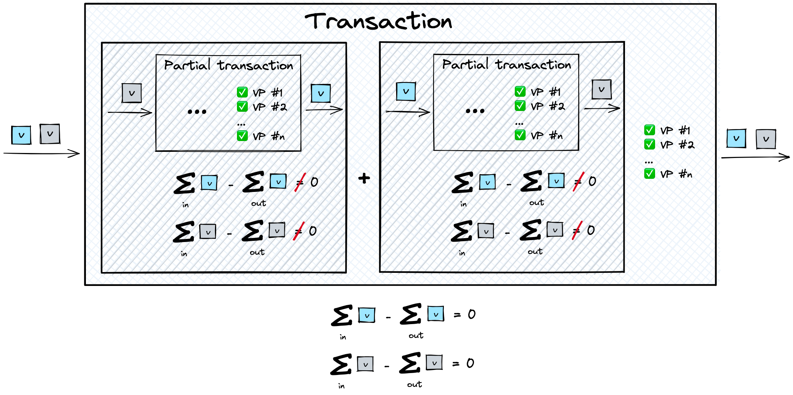
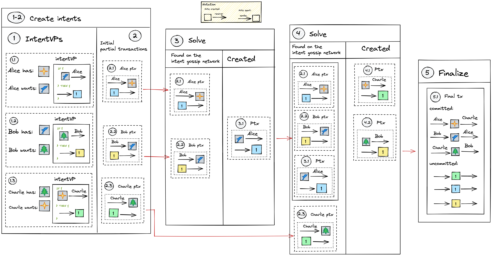
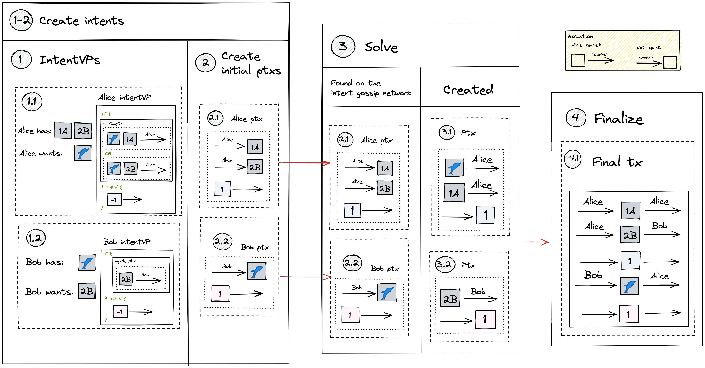
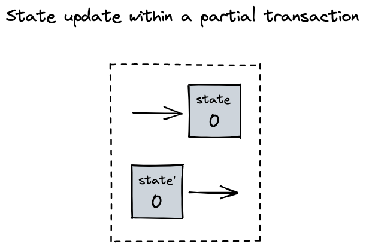
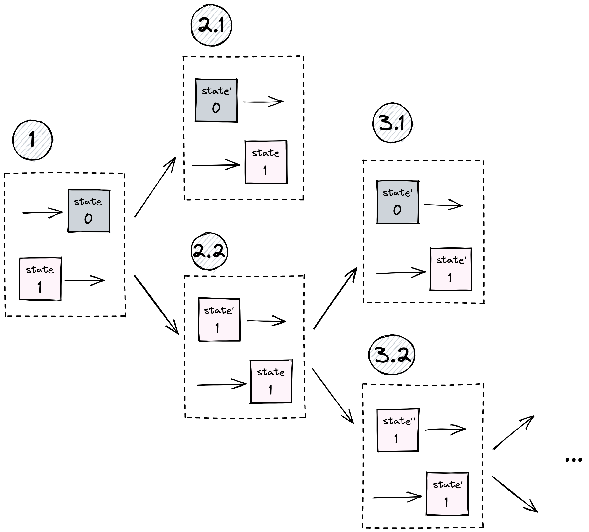

# Taiga execution model

## On a high level
**Intents** are a mechanism that allows users to enact a multiparty state transition. Users express their interests with intents, and Taiga makes sure that the intents are satisfied atomically.

Here is the high level description of the process, starting from creating intents and ending up publishing a blockchain transaction representing the desired state transition:
1. **Create**: A user creates an intent, publishing the information of what they have and what they want
2. **Gossip**: The intent goes to the intent gossip network and is gossiped around the solver nodes
3. **Solve**: Solvers find matching intents and create partial transactions until the intent is fully satisfied
4. **Finalize**: When the intent is satisfied, a transaction is created and published on the blockchain

## Step 1: Create an intent

Intents specify ephemeral interests of users. The step of intent creation consists of two parts:
1. **Specify an intent**. `IntentVP` encodes the user interests in the [VP](./validity-predicates.md) form. As in a valid transaction all VPs must evaluate to `True`, the intent is guaranteed to be satisfied.
2. **Create the initial *partial transaction***.

### Partial transaction

Two of the main requirements for an Anoma transaction to be valid are: 
1. VPs of all involved in the transaction parties must be satisfied.
2. The transaction must be **balanced** , i.e the value spent in the transaction minus the value output equals to some predefined value `v`, the **balancing value**. The balancing value is transparent (visible to observers) and can be involved in interactions with the transparent system.

We call a **partial transaction** a state transition where the first requirement is satisfied (all VPs evaluate to True), but the second one isn't (the state transition is unbalanced). Such a state transition isn't a valid transaction and cannot be published on the blockchain, 
but can be combined with other partial transactions in order to build a valid transaction. 

Partial transactions are immutable objects, and once they are created, they cannot be changed. 
In principle, any party can create a partial transaction, if they can prove that the VPs of the parties involved in the partial transaction are satisfied. 

**Initial partial transactions** are the partial transactions that users create at the beginning, spending the notes that will be given to the counterparty once the intents are matched.

**Note**: For simplicity we assume that intents imply both sending notes and receiving notes.

As a part of the initial partial transaction, users also output **intent token notes**. 
### Intent tokens

**Intent tokens** are a mechanism that makes sure that the partial transaction is *unbalanced* until the corresponding intent is satisfied, making it impossible to publish the transaction.

Intent token notes are **dummy** notes - meaning that unlike "normal" notes, the merkle path isn't checked for them (but they can have arbitrary value and stored in the CMtree, just like "normal"). 

**Note**: being a dummy note and having zero value are two independent concepts in Taiga. Zero value notes aren't necessarily dummy, dummy notes can have non-zero value.

How intent tokens are used:
1. Spending notes in the initial partial transaction, the user additionally outputs intent token note of value [1].
This note will only be spent if the user's intent (intentVP) is satisfied.
2. Once all of the parties involved in a state transition spent their intent token notes (meaning that the intents of all of them are satisfied), the transaction is balanced and can be finalized.

### IntentVP

To validate a transaction, it is required that `userVP` of each involved user was satisfied. The part of the userVP that is responsible for validating the future transaction (satisfying the user's intent) is exposed in the intentVP, along with the description of the intent (so that the solver knows what it takes to satisfy the user interests). Later IntentVP is checked in the circuit, validating the state transition.  

### Message passing

If we look at the intent token notes as messages passing from one user (application) to another, the output [1] intent note can signal a message being sent, and spending of that note will signal that the message has been received. See more about the idea of message passing [here](message_passing.md).

## Step 2: Gossip
Once the intentVP is specified and the initial partial transaction is created, the user sends everything to the intent gossip network. Gossip nodes send those intents to each other, spreading them around. Solvers listen to the intent gossip network and receive the intents.

## Step 3: Solve

Solvers receive intents from the intent gossip network and match them together in order to create transactions. 

That implies that users need to give some information to the solvers that is sufficient to create partial transactions and transactions (to create proofs). In order to match two intents, the solver needs to know:
- intentVPs of both matching parties
- note commitments and nullifiers from prior partial transactions (to be chained)
- proofs from prior partial transactions (to be chained)
- for the notes spent/output in the new partial transaction: nullifier key, commitments to the sender/receiver VPs, note fields

We are considering the model where a solver makes one step at a time and sends the step result back to the gossip network, where the partial solution meets the next solver in the chain. In practice, the solver can continue solving instead of sending the result back to the gossip network if they can make the next step.

### Create partial transactions

When a solver has intents that can be [partially] matched together, they [partially] match the intents by creating new partial transactions. Solvers cannot modify the old data, only create new (e.g. new partial transactions).

#### Prove
Solvers are responsible for creation of all proofs (`Action`, `VP`, etc) required for their partial solutions. For that reason, solvers:
- **have the authority** to spend and create the notes they receive and produce the proofs required to perform the action,
- **know** the content of intentVPs of the users (necessary to be able to satisfy them),
- **don't know** the identities of the users.

When solvers receive partial solutions from the gossip network, they must check all of the proofs attached to them.

#### Local `cm` trees

To store note commitments of the created notes, a local commitment tree `CMtree` is created. After the transaction is finalized, the tree will be published on the blockchain along with the transaction.

### Partial vs final match

After the solver matches the intents, two cases are possible:
1. At least one of the total per-token balances computed by summing up the per-token balances of partial transactions doesn't equal the balancing value. In this case, the solver sends the data to the gossip network.
2. All total per-token balances are equal to the balancing values. A valid transaction can be created and published.

**Note**: in the current implementation we assume a simpler model with no partial solving.

**Note**: solvers don't need to be identified as all actions are authorized by user/app VPs. However, if they want to receive fees, they need to have an address on the chain.

## Step 4: Finalize

After the intents are matched with satisfaction of all involved parties, the transaction is published on the blockchain. The local CMTree and all of the proofs created are published on the blockchain.

## Examples

Let's see how different use cases can be handled with this execution model.

**Note**: For simplicity in the examples below we assume that the balancing value `v` is equal to zero.

### 1. Three-party barter

Three parties, Alice, Bob, and Charlie, are looking for some assets in exchange for something else. Their intents can be matched into a three-party bartering cycle. Let's see step by step how this happens.

**Note**: parties don't require three-party bartering explicitly.

**Step 1-2**: The users define their intents and create intentVPs. It doesn't have to happen at the same time for all users, but for simplicity we describe it as one step. The intentVPs of all three users have the same structure: users are willing to spend their asset (Alice - a star, Bob - a dolphin, Charlie - a tree) in exchange for some other asset. Once the user receives the desired asset, the intent token note is spent. In addition to that, all three users also create their initial partial transactions spending the asset they are ready to give away (Alice ptx, Bob ptx, and Charlie ptx).

**Step 3**: A solver sees Alice's ptx and Bob's ptx, matches them together, and creates a new partial transaction. Alice's intentVP is satisfied, and her intent note is spent. 

Total per-token balances:

|token|spent|output|spent - output|
|-|-|-|-|
|star NFT|1|0|1|
|blue dolphin NFT|1|1||
|blue intent token|[1] - [1]|-|0|
|yellow intent token|[1] |-|[1]|

**Step 4**: A solver sees all previous partial transactions and the initial transaction created by Charlie. The solver matches them together and creates new partial transactions, sending the tree to Bob and the star to Charlie. VPs of Bob and Charlie are now satisfied, the corresponding intent notes are spent. The  per-token balance of partial transactions is equal to zero, which means it is possible to create a transaction.
Total per-token balances:

|token|spent|output|spent - output|
|-|-|-|-|
|star NFT|1|1|0|
|blue dolphin NFT|1|1|0|
|blue intent token|[1] - [1] = [0]|-|0|
|yellow intent token|[1] - [1]|-|0|
|tree NFT|1|1|0|
|green intent token|[1] - [1]|-|0|

**Step 5**:
The final transaction containing the spent and output notes from partial transactions is created with all proofs attached.

### 2. Complex intentVP

Let's consider the situation where one of the parties has a complex VP (compared to the VPs above). Here Alice has two notes: [1] of token A and [2] of token B and wants to get a blue dolphin NFT in  exchange for one of them and get the other one back. Bob has a simple intentVP as in the example above.

**Step 1-2**: Alice and Bob create their intentVPs and initial partial transactions. Alice spends both of the notes she is ready to give away, expecting to receive one of them back (the other one will go to the counterparty).

**Step 3**: A solver sees Alice's and Bob's partial transactions and matches them together. Alice receives the blue dolphin NFT and one of her notes ([1] of A) back, her intentVP is satisfied and Alice's intent token note is spent. Bob get's [2]B note from Alice, his intentVP is satisfied, his intent token note is spent. All total per-token balances are equal to 0, and the final transaction can be created.

**Step 4**: The final transaction is created using the spent and output notes from the partial transactions.

### 3. One way to represent arbitrary states

For an arbitrary application, notes store the state of the application. When the application needs to change its state, it (i.e. any party that has the authority) can spend the old state and produce a new state.
If the state change is possible within one partial transaction, such a note has a value 0 and doesn't affect the total balance.

If the state change happens across partial transactions (meaning that the state gets consumed in one partial transaction and a new state is output in another), the process is a bit different. 

#### State transition across partial transactions

For simplicity, let's assume that the old state note has a 0 value. A zero-value note doesn't affect the total balance which is necessary for across-ptx communication. And so the first step is to turn a zero-value note into a non-zero value note (step 1 on the diagram).

In the next partial transaction (step 2) we spend a [1] value note to balance the created [1] state note, but if the state can be changed to final in the next partial transaction (step 2.1), a new state zero-value note is produced, total balance becomes zero, and the transaction can be finalized. If the state isn't final (step 2.2), another [1] value note with the new (but not final) state is produced, the total balance is non-zero and the transaction cannot be finalized. In that case, the step 2 is repeated until the final state is computed.

**Note**: different states imply different token types, and the old state note cannot balance a new state note.