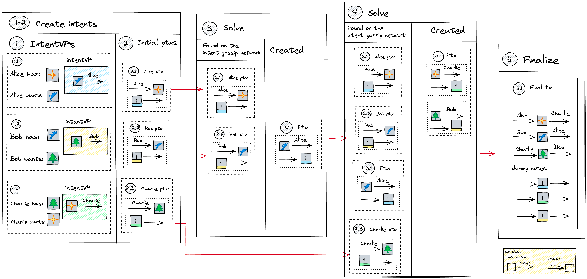

# Execution model examples

Let's see how different use cases can be handled with the Taiga execution model.

**Note**: For simplicity in the examples below we assume that the balancing value `v` is equal to zero.

### 1. Two-party exchange with an intent userVP

Let's consider the situation where one of the parties uses the intent application, and the other party doesn't.
Here Alice has two notes [1]A and [2]B and wants to get a blue dolphin NFT in exchange for one of them and get the other one back.
Alice uses intent application to express her preferences. Bob has a blue dolphin NFT and wants [1]A in exchange for it.
As Bob knows what he wants, no intent userVP needed.

**Step 1-2**: Alice creates her intent userVP, both Alice and Bob create their initial partial transactions.
Alice spends both of her notes she could give away, expecting to receive one of them back (the other one will go to Bob).

**Step 3**: A solver sees Alice's and Bob's partial transactions and matches them together.
Alice receives the blue dolphin NFT and one of her notes ([2]B) back,
her intent userVP is satisfied and Alice's intent note is spent. Bob has already sent himself the note he wanted, so the solver doesn't create notes for Bob.
All total (accumulated over ptxs) per-token balances are equal to 0, and the final transaction can be created.

**Step 4**: The final transaction is created using the spent and output notes from the partial transactions.

#### Partial transactions' details

||spent notes|created notes|Apps|VP proofs|total balance (accumulated)|
|-|-|-|-|-|-|
|ptx #1 (Alice)|[1]A, [2]B|[1]Alice-intent-note|intent app, A app, B app|Alice intent userVP, intent app 
VP, Alice A userVP, A appVP, Alice B userVP, B appVP (6)|-[1]A-[2]B + [1]Alice-intent-note|
|ptx #2 (Bob)|[1]blue-dolphin-NFT|[1]A|blue-dolphin-NFT app, A app|Bob A userVP, A appVP, Bob blue-dolphin-NFT userVP, blue-dolphin-NFT appVP (4)|-2[B] - [1]blue-dolphin-NFT + [1]Alice-intent-note
|ptx #3 (Solver)|[1]Alice-intent-note|[1]blue-dolphin-NFT, [2]B|intent app, blue-dolphin-NFT app, B app|Alice blue-dolphin-NFT userVP, NFT appVP, Alice intent userVP, intent appVP, Alice B userVP, B appVP (6)|0|

We assume here that all applications support userVPs and that both Alice and Bob have a userVP in each application.

### 2. Three-party barter

Alice, Bob, and Charlie, are looking for some NFTs in exchange for other NFTs.
Their intents can be matched into a three-party bartering cycle. Let's see step by step how this happens.

**Note**: parties don't ask for a three-party bartering explicitly.

**Note**: in the example below each party uses the intent app to describe simple requests that can be satisfied without the intent app.
Even though it isn't necessary to use the intent application for simple requests, it helps to show how the intent app can be used without making the diagram and the example overcomplicated.

**Step 1-2**: The users create their intent userVPs. It doesn't have to happen at the same time for all users,
but for simplicity we describe it as one step. The intent userVPs of all three users have the same structure:
users are willing to spend their asset (Alice - a star, Bob - a dolphin, Charlie - a tree) in exchange for some other asset,
and once the user receives the desired asset, the user's intent is satisfied.
Users create their initial partial transactions spending the asset they want to give away (Alice ptx, Bob ptx, and Charlie ptx).

**Step 3**: A solver sees Alice's ptx and Bob's ptx, matches them together, and creates a new partial transaction
(expecting to find a third ptx to create the cycle). Alice's intent userVP is satisfied, and her intent note can be spent.
The solver adds the required VP proofs to the freshly created partial transactions.

Total per-token balances:

|token|spent|output|spent - output|
|-|-|-|-|
|star NFT|1|0|1|
|blue dolphin NFT|1|1|0|
|blue intent|1|1|0|
|yellow intent|0|1|1|

**Step 4**: A solver sees all previous partial transactions, and the initial transaction created by Charlie.
The solver matches them together and creates new partial transactions, sending the tree to Bob and the star to Charlie.
VPs of Bob and Charlie are now satisfied, the corresponding intent app notes are spent.
The  per-token balance of partial transactions is equal to zero, which means it is possible to create a transaction.
Total per-token balances:

|token|spent|output|spent - output|
|-|-|-|-|
|token|spent|output|spent - output|
|-|-|-|-|
|star NFT|1|1|0|
|blue dolphin NFT|1|1|0|
|blue intent|1|1|0|
|yellow intent|1|1|0|
|tree NFT|1|1|0|
|green intent|1|1|0|

**Step 5**:
The final transaction containing the spent and output notes from partial transactions is created with all proofs attached.

### 3. One way to represent arbitrary states

For an arbitrary application, notes store the state of the application. When the application needs to change its state,
it (i.e. any party that has the authority) can spend the old state and produce a new state.
If the state change is possible within one partial transaction, such a note can have value 0 and doesn't affect the total balance.

If the state change happens across partial transactions (meaning that the state gets consumed in one partial transaction, and a new state is output in another),
the process is a bit different.

#### State transition across partial transactions

For simplicity, let's assume that the old state note has a 0 value.
A zero-value note doesn't affect the total balance which is necessary for across-ptx communication.
And so the first step is to turn a zero-value note into a non-zero value note (step 1 on the diagram).

In the next partial transaction (step 2) we spend a [1] value note to balance the created [1] state note,
but if the state can be changed to final in the next partial transaction (step 2.1), a new state zero-value note is produced,
total balance becomes zero, and the transaction can be finalized. If the state isn't final (step 2.2),
another [1] value note with the new (but not final) state is produced, the total balance is non-zero and the transaction cannot be finalized.
In that case, the step 2 is repeated until the final state is computed.

**Note**: different states imply different note types, and the old state note cannot balance a new state note.
