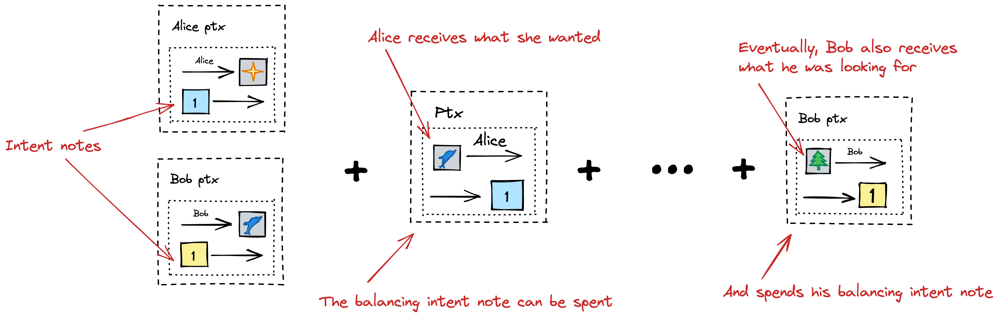

# Intent Application

**Intent application** allows users to express their interests with high level of uncertainty about the final state transition. 
When a user doesn't have a specific interest but can be satisfied with multiple versions of a state transition, intents help.

Like all other applications, intent application has an application VP that defines the application logic. 
Users of the intent application express their preferences in their `userVP`s.
**Intent appVP** hierarchically enforces the check of **intent userVP**s, 
and **intent application notes** are used to keep the transaction unbalanced (to make sure it doesn't get published), 
until the interests of all users are satisfied.

### Intent notes

Users express their preferences in their intent userVPs. For each intent userVP there is a corresponding note type derived from that userVP.
Notes of that type are responsible to make sure that the intent userVP used to derive their value base is satisfied.

Strictly speaking, the notes don't make the intent userVP to be satisfied, 
but rather make sure that the transaction doesn't get published until the intent userVP is satisfied.

When a user specifies their intent, they create an intent note with the value base derived from their VP and value 1.
This note gets spent (balancing the transaction) only when the underlying intent is satisfied. 
Only a fully balanced transaction can be published on the blockchain, 
and balancing the intent notes requires satisfying the intent userVPs.

#### Dummy notes

Intent app notes are **dummy** notes - meaning that unlike "normal" notes, the merkle path isn't checked for them (but they can have arbitrary value and stored in the CMtree, just like "normal").

**Note**: being a dummy note and having zero value are two independent concepts in Taiga. Zero value notes aren't necessarily dummy, dummy notes can have non-zero value.

#### How intent app helps

How to use the intent application:
1. Spending notes in the initial partial transaction, the user additionally outputs intent note of value [1].
   This note will only be spent if the user's intent userVP is satisfied.
2. Once all the parties involved in a state transition spent their intent app notes (meaning that the interests of all of them are satisfied), the transaction is balanced and can be finalized.
   

The solvers need to know the content of the intent userVPs to know how to satisfy them.

Users can still use intents to express their interests even when they know what they want, but it is more expensive and unnecessarily complicated
