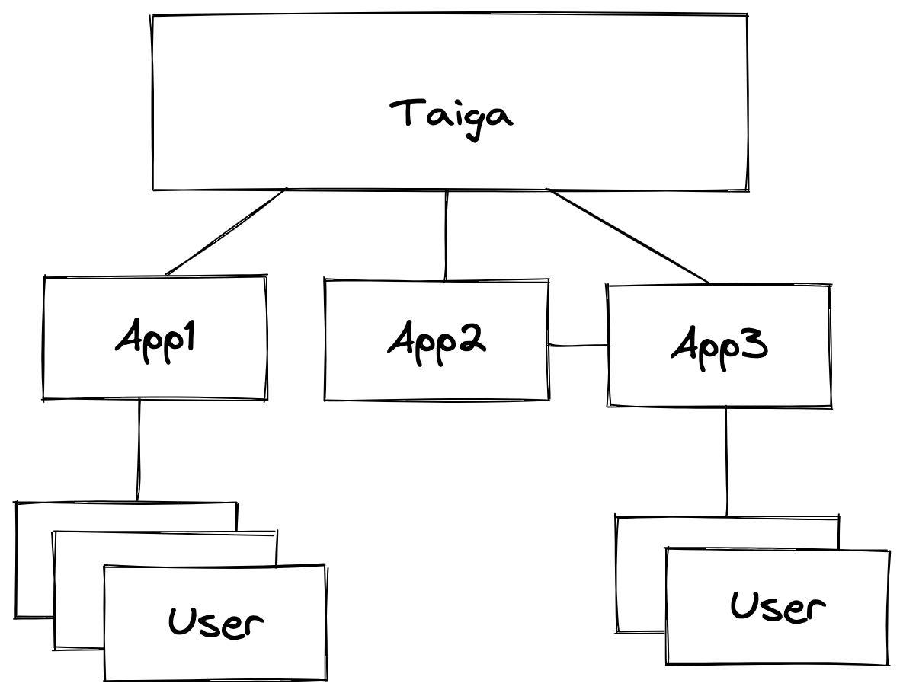

# Introduction

Taiga is a schielded state transition protocol that allows applications built on top of it to enjoy the advantages of fully shielded multi-party state transitions (hiding the application type, the data associated with it, involved parties, etc) without giving up the application complexity.

**Validity predicates** are a key component of Taiga - applications built on top of Taiga use them to express the application rules, and Taiga makes sure that the rules are being followed.
Validity of a transaction is defined by validity predicates of all involved applications and parties.

Everything in Taiga is hidden under ZKPs. Transactions of different applications are indistinguishable from one another and all applications can benefit from the shared shielded pool of transactions.

Some of the nice Taiga features:
* Support of arbitrary *atomic* multi-party state transitions
* Data and *function privacy*: to a third-party observer, all transactions look the same
* *Matchmaking* is taken care of: with the help of *intent application* and *solvers* finding counterparties became easy
* Taiga is compatible with transparent Anoma. Assets can be moved between the transparent and shielded pool, applications can support both types of state transitions (if they want)
* Performance benefits from using PLONK arithmetization (including lookups)

