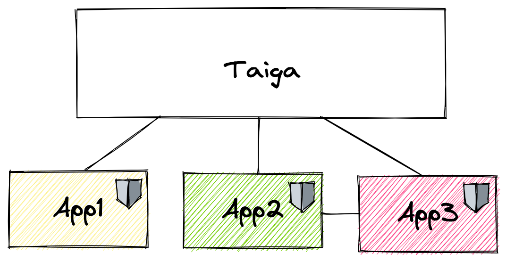
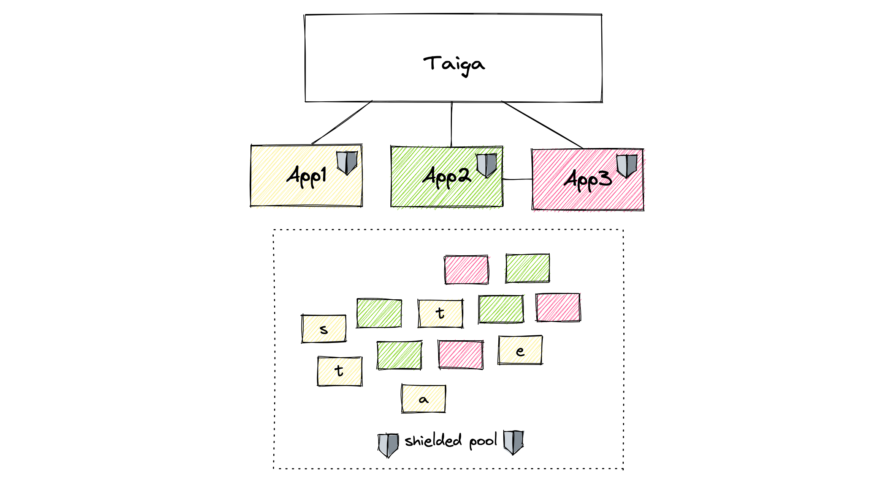

# Introduction

Taiga is a **shielded** state transition protocol that allows applications built on top of it to enjoy the advantages of fully shielded multi-party state transitions 
(hiding the application type, the data associated with it, involved parties, etc) without giving up the application complexity.

[**Validity predicates**](./validity-predicates.md) are a key component of Taiga - applications built on top of Taiga use them to express the application rules, 
and Taiga makes sure that the rules are being followed. The [Action circuit](./action.md) is responsible for checking that the Taiga rules are preserved.

The state transition is considered to be valid if validity predicates of all involved parties are satisfied, and the Action circuit check passed successfully.

#### ZKP privacy

Taiga uses zero-knowledge proof system Halo2 to hide the sensitive information about the state transitions (application types, parties involved, etc). 
Transactions of different applications are indistinguishable from one another and all applications benefit from the shared shielded pool of transactions.

#### UTXO model

Taiga is based on the UTXO model - the application states are stored in immutable objects called **notes**. 
To update the state, an application (or anyone with sufficient rights) would spend the notes containing the old state and create notes containing a new state.

#### Some of the nice Taiga features

* Support for arbitrary *atomic* multi-party state transitions
* Data and *function privacy*: to a third-party observer, all transactions look the same, no matter what applications are involved
* *Matchmaking* is taken care of: with the help of *intent application* and *solvers* finding counterparties became easy
* Taiga is compatible with transparent Anoma. Assets can be moved between the transparent and shielded pool, applications can support both types of state transitions (if they want)
* Performance benefits from using PLONK arithmetization (including lookups)

