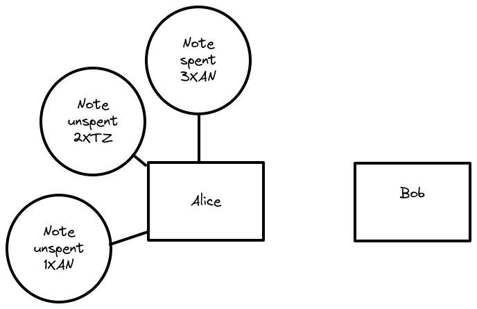

# Taiga by example
We provide an overview of Taiga illustrated with a simple example where Alice wants to send 1XAN to Bob.
In the following sections, we describe how we structure the different entities involved in a transaction, how we achieve privacy in this context and our choice of implementation.

----
What we want to explain here:
* UTXO principle
* Users and token VP
* Action VP
* Circuit randomization.
----

## Overview of Taiga

### Taiga description
Taiga provides a way to reach customizable and fully private transactions in the context of [Anoma](https://anoma.network).
> There are two important words in this tiny description: "customizable" and "private".
> * Customizable means that we want the different entities to be able to choose different conditions to be satisfied for a transaction. One condition could be "accept only XAN transactions" for Bob, or "transactions cannot exceed 10 tokens" for the XAN token.
> * Fully private means that we don't want to leak information on the entities during a transaction. We will see later that customizability and privacy are closely related when the customizable condition are public information.

### Actors of Taiga
Different entities are involved in a transaction. Users are entities that can define conditions for a transactions, but we have also seen that a token is another entity which is able to define rules for the transactions.
> Taiga is built over "unspent notes", meaning that when Alice wants to send 1XAN to Bob, it means that she owns at least 1XAN from latter notes. This can be seen as a note of 1XAN received before, but it could also be two notes of 0.5XAN, or one note of 3XAN. 

In our current implementation, we consider different entities:
* Users. They can define receiving and sending conditions for their transactions.
* Tokens. They can define conditions for transactions involving their tokens.
* Notes. They are related to users and tokens. During a transaction, several conditions related to notes are verified.

### Verifications in Taiga
During a transaction, there are several conditions called Validity Predicates (VP) that need to be verified.

#### User VPs
These are defined by users, and are split into sending and receiving VPs.
> If Alice sends 1XAN, we verify the Alice's sending VP. If Bob receives 1XAN, we checks its receiving VP.

#### Token VPs
These are token rules related to transactions.
> In our example, we could consider that XAN transactions cannot involve more than 10XAN. During the transaction, the XAN VP would check that the amount that Alice wants to send is less than 10XAN.

#### Action VP
These conditions are binding the notes together with users, tokens, etc.
> When Alice sends 1XAN to Bob, the action circuit checks that the owner of the old note is indeed Alice, that the token corresponding to this note is XAN.
> The action circuit also bind Alice and XAN to the users and token VPs above.

## Privacy in Taiga

Anoma enables privacy using zero-knowledge proofs. 

### Zero-knowledge proofs in Taiga
Taiga proofs are built using a construction called PLONK.
Each proof proves the knowledge of a secret `ω`, corresponding to an assertion described by a circuit.
> In the case of our example, we can consider `ω = 1` to be the secret amount of XAN sent to Bob, and the circuit can be a check that `ω` is between `0` and `10`.

Once the proof `π` is built, anyone *knowing the circuit* can verify the proof `π`.
> In our example, a verifier can check that `Verify(Circuit, π) == true`, and he is convinced that `ω` is indeed between `0` and `10`, without knowing `ω`.

In the context of Taiga, we want to build customizable circuits: users (but also tokens) can define their own rules.
> Alice and Bob can define a very specific rule such as "I want to receive tokens from people whose name begins with a `A` and ends with `ice`".

## Achieving private customizable validity predicates
Customizable enable flexible rules for users and tokens, but also leak information on the user: when a user (or a token) defines a very specific custom circuit, it clearly reveal its identity to everybody.
In a classical zero-knowledge construction, circuits are public information but in our use-case, we want them to be private for achieving fully private transactions.
To do so, we randomize the circuits: in PLONK, equivalent conditions can be represented with different circuits. Circuits are transformed into polynomials, and we can simply add a random multiple of the vanishing polynomial without modifying the initial circuit. 

> The sending conditions of Alice could be "It is not allowed to send more than 1XAN". In this context, the circuit corresponds to checking that `amountTransaction <= 1`. This is an arithmetic circuit, and in PLONK, it corresponds to a bunch of polynomials `q_L(x)`, etc. We consider in Taiga `q_L(x) + rand(x) Z_H(x)` so that no one can recognize the circuit.

We will see latter that the initial circuit needs to be committed so that a verifier knows that the circuit is the right one.

----

CONTINUE HERE. IMO, still messy how the description of the action is written...

Questions:
* Should we talk about the UTXO model in the first line of this page?
* Where should we talk about action/action circuit
* Should we go into details on the deep crypto stuff here?
* ...

----

## The action circuit
Action is also verified using a ZK proof. Includes the randomization check?

## Cryptography for Taiga
### Circuit-friendly primitives
Commitments with hash, Merkle trees, encryption with El Gammal, etc. All need to be "circuit-friendly" meaning that we want to be able to build reasonably small circuits for all these primitives.
### The ZK construction
PLONK with ZK-garage. Elliptic curves and requirement of BaseField / ScalarField.

### Choice of curves
KZG curves: `ed_on_bls12_377` -- `bls12_377` -- `bw6-761` for succinct proof. Open to IPA commitment scheme thanks to Vamp-ir.
