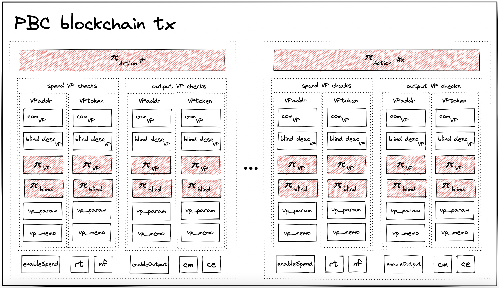

# Transaction

## Overview
The structure `Transaction` defines all the information needed to be executed on the blockchain.
Once a transaction is executed successfully (i.e. verified), the ledger status will be transfered.
A transaction includes the proofs corresponding to the spending of input notes and the creation of output notes.

In our current implementation version, there are four input notes and four output notes in each transaction. A transaction is split into *action transfers*.

## Action Transfer
An action transfer spends an input note and creates an output note. To do so, it verifies:
* one `SendVP` proof and one `TokVP` proof corresponding to an input note,
* one `RecvVP` proof and one `TokVP` proof corresponding to an output note,
* one action proof corresponding to the integrity of the owner and token addresses of the two notes,
* that the input note already exists and is not spent,
* the output note encryption.

The details of the action transfer can be found [here](src/transaction.rs).

## Proofs of a transaction
A transaction includes several proofs for the different VPs and for the actions and the blinding proofs.
In this current implementation, we set `NUM_NOTE=4` for the number of input and output notes. Moreover, for we are interested in the `SendVP` and the `TokVP` of input notes and `RecvVP` and `TokVP` of output notes. Finally, every validity predicate is blinded as described [here](blinding.md), leading to a blinding proof.
Therefore, a transaction includes:
* Four `SendVP` proofs corresponding to the four input notes owner constraints,
* Four `TokVP` proofs corresponding to the four input note token constraints,
* Four `RecvVP` proofs corresponding to the four output note owner constraints,
* Four `TokVP` proofs correspdonding to the four output note token constraints.
* Sixteen blinding proofs for the 16 previous proofs,
* Four action proofs for binding the 16 first proofs of this list to the actual input and output note owner and token addresses, as described [here](action.md).




## How to build a transaction
Building a Taiga transaction is flexible: a transaction can be created from different [users](link) and splitted into several phases. In general, we can build a transaction as the following procedures:
1. Create `Actions`,
2. Collect all the (input and output) notes from the actions as local data for VPs,
3. Create user and token validity predicates,
4. Generate the blinding proofs,
5. Build the full transaction.

The following example build a transaction following this procedure:
```rust
// Construct action infos
let mut actions: Vec<(Action<CP>, ActionCircuit<CP>)> = (0..NUM_TX_SLICE)
    .map(|_| {
        let action_info = ActionInfo::<CP>::dummy(&mut rng);
        action_info.build(&mut rng).unwrap()
    })
    .collect();
// Generate action proofs
let action_slices: Vec<ActionSlice<CP>> = actions
    .iter_mut()
    .map(|action| ActionSlice::<CP>::build(action.0, &mut action.1).unwrap())
    .collect();
// Collect input notes from actions
let input_notes_vec: Vec<Note<CP>> = actions
    .iter()
    .map(|action| action.1.spend_note.clone())
    .collect();
let input_notes: [Note<CP>; NUM_NOTE] = input_notes_vec.try_into().unwrap();
// Collect output notes from actions
let output_notes_vec: Vec<Note<CP>> = actions
    .iter()
    .map(|action| action.1.output_note.clone())
    .collect();
let output_notes: [Note<CP>; NUM_NOTE] = output_notes_vec.try_into().unwrap();
// Construct VPs and generate VP proofs and blind VP proofs
let mut spend_slices = vec![];
let mut output_slices = vec![];
for _action_index in 0..NUM_TX_SLICE {
    // Construct dummy spend slice
    let mut spend_addr_vp = FieldAdditionValidityPredicate::<CP>::new(
        input_notes.clone(),
        output_notes.clone(),
        &mut rng,
    );
    let spend_addr_vp_check = VPCheck::build(&mut spend_addr_vp, &mut rng).unwrap();
    let mut spend_token_vp = FieldAdditionValidityPredicate::<CP>::new(
        input_notes.clone(),
        output_notes.clone(),
        &mut rng,
    );
    let spend_token_vp_check = VPCheck::build(&mut spend_token_vp, &mut rng).unwrap();
    let spend_slice = SpendSlice::new(spend_addr_vp_check, spend_token_vp_check);
    spend_slices.push(spend_slice);
    // Construct dummy output vps
    let mut output_addr_vp = FieldAdditionValidityPredicate::<CP>::new(
        input_notes.clone(),
        output_notes.clone(),
        &mut rng,
    );
    let output_addr_vp_check = VPCheck::build(&mut output_addr_vp, &mut rng).unwrap();
    let mut output_token_vp = FieldAdditionValidityPredicate::<CP>::new(
        input_notes.clone(),
        output_notes.clone(),
        &mut rng,
    );
    let output_token_vp_check = VPCheck::build(&mut output_token_vp, &mut rng).unwrap();
    let output_slice = OutputSlice::new(output_addr_vp_check, output_token_vp_check);
    output_slices.push(output_slice);
}
// Construct a tx
let tx = Transaction::<CP>::new(action_slices, spend_slices, output_slices);
```
This transaction `tx` can be verified, meaning that the VPs, action and blinding proofs are checked.
In addition, this verification checks the consistency of the public inputs from the above proofs and the ledger status (root existence, nullifier non-existence, etc.).
```rust
// Tx verification
tx.verify(ledger_status)?;
```

This code is reproducible with [this file](https://github.com/anoma/taiga/blob/main/src/doc_examples/transaction.rs) with the following command:
```
cargo test --release test_tx_example
```

Next: [performance & conclusion](./conclusion.md)