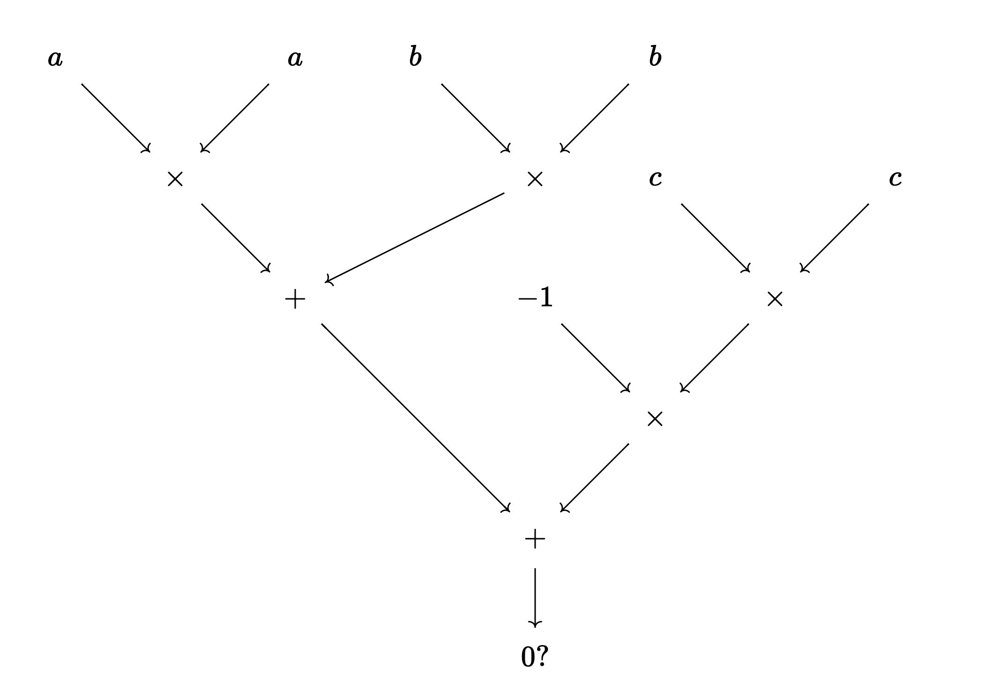

# Validity predicate definition

A validity predicate can be seen as a set of rules that checks whether a given statement holds, that is, it returns true if the predicate is satisfied or false otherwise. Every predicate can be compiled to an arithmetic circuit. Rules in arithmetic circuits are additions and multiplications of integers. If the output of the circuit is zero, then the predicate is valid. The flavour of the circuit may depend on the proving system we want to use. Some proving systems can only evaluate a two fan-in gates whereas others have other gate constraints.

## Example 1. a Pythagorean circuit.
Suppose that we have a pythagorean triple $(a,b,c)$. We can consider a validity predicate that checks the equation $a^2 + b^2 == c^2$.

This predicate can be represented as an arithmetic circuit as follows:

<!-- https://q.uiver.app/?q=WzAsMTQsWzAsMCwiYSJdLFsxLDEsIlxcdGltZXMiXSxbMiwwLCJhIl0sWzMsMCwiYiJdLFs0LDEsIlxcdGltZXMiXSxbNSwwLCJiIl0sWzIsMiwiKyJdLFs1LDEsImMiXSxbNywxLCJjIl0sWzYsMiwiXFx0aW1lcyJdLFs0LDIsIi0xIl0sWzUsMywiXFx0aW1lcyJdLFs0LDQsIisiXSxbNCw1LCIwID8iXSxbMCwxXSxbMiwxXSxbMyw0XSxbNSw0XSxbMSw2XSxbNCw2XSxbMTAsMTFdLFs5LDExXSxbNiwxMl0sWzExLDEyXSxbNyw5XSxbOCw5XSxbMTIsMTNdXQ== -->

Alternatively, we can see each gate as a polynomial equation. As mentioned, the proving system determines the shape of the polynomial equations, that is, the type of gate. For example, in a proving system such as Groth 16, the system of equations is called R1CS (Rank-1 Constraint System); there can only be one multiplication of variables in each gate while as many affine operations (i.e. additions) as desired.

$$
\begin{align*}
a \cdot a &= i_1 \\
b \cdot b &= i_2 \\
c \cdot c &= (-1) \cdot i_3 \\
i_1 + i_2 &= i_4 \\
i_3 + i_4 &= o
\end{align*}
$$

Meanwhile, in the proving system we use in Taiga, Plonk, gates need to be of the form $q_L \cdot a + q_R \cdot b + q_O \cdot c + q_M \cdot ab + q_c = 0$. 

To prove that we know private inputs $a, b, c$ such that $a^2 + b^2 = c^2$ we need a zero knowledge proving system.

## Example 2. Signature verification.
Given a message signed by a user using the ECDSA algorithm, the signature verification VP describes all the computations needed to verify an ECDSA signature. It involves a hash function, the elliptic curve group law and a modular reduction. All these computations are additions and multiplications that can be described into a circuit.

In the next section, we detail three examples of validity predicates in the context of Anoma.