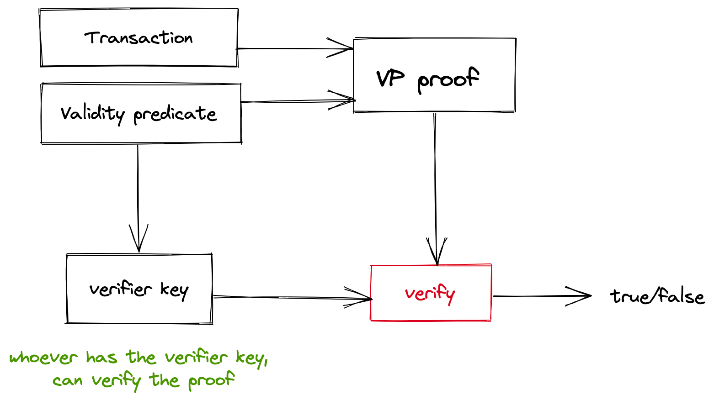

# Validity predicate (VP)

A **validity predicate** (VP) is a piece of code that authorizes transactions. Users express their preferences (who to transact with, what actions are allowed, what tokens are accepted, etc) in VPs, and VPs check proposed state transitions to ensure that the user requirements are satisfied.

A valid (can be published on the blockchain) transaction satisfy the VPs of all involved parties (but not only that, see [Transaction](transaction.md)).

#### Examples of VPs
- white list VP allows only specific users to send notes to the VP owner
- lower bound VP restricts the smallest amount of asset that can be received


Validity predicates exist in both transparent and shielded Anoma (Taiga). Unlike transparent Anoma  VPs that are represented as WASM code and publicly visible, Taiga VPs are arithmetic circuits hidden under ZKP. 
To make sure that the state transition is allowed by the user, Taiga VPs take the current state (expressed by the spent notes) and the next proposed state (expressed by the output notes) as input and perform various checks.

## VP types in Taiga

#### userVP (sendVP/recvVP)
Users define their long-term preferences via `userVP`. Every transaction the user is involved into has to be approved by the user's VP in order to be considered valid. There are two types of `userVP`:
* `SendVP` defines the conditions on which notes can be sent (e.g. signature check)
* `RecvVP` defines the conditions on which a note can be received by the user (e.g. sender whitelist)

#### intentVP
`IntentVP` helps a user to express their ephemeral interests and make sure the interests are satisfied. Learn more about intents and `intentVP` [here](./exec.md) (TODO: isn't merged yet).

#### applicationVP
Applications can define the conditions on which they can be used via `applicationVP`. Everytime notes of a certain application are created or spent in a transaction, the `applicationVP` is called to validate the transaction.

### Validity predicates as arithemtic circuits

To prove that VPs are satisfied without revealing their content, ZKPs are used. Each transaction has VP proofs of involved parties attached to it, and whoever has the verifier key (VK), can verify the proofs.



#### PLONKish circuits for VPs

Taiga uses a PLONK-based ZKP system (Halo2/ZK-Garage Plonk), and validity predicates are represented as [PLONKish circuits](https://zcash.github.io/halo2/concepts/arithmetization.html). For privacy reasons, all Taiga VPs share the same PLONK configuration (the set of "gates" available), and different VPs are created by specifying the *selectors*.

The VP configuration includes the following "gates" in the PLONK configuration:

* Field addition/multiplication
* Elliptic curve addition and scalar multiplication
* Poseidon hash
  
TODO: rephrase

### VP checks per transaction

In every transaction some notes are spent and some notes are created. 
* For every spent note, `sendVP` of its owner is called
* For every output note, `recvVP` of the recipient is called
* `intentVP` of every user whose intent was involved in the tx is called
* Every note belongs to some application. For every application that has its notes involved in the transaction, its `appVP` is called.

Every VP has all spent and output in the transaction notes as input and is called once per transaction (e.g. if two notes of the same app exist, the `appVP` is called only once and is checking the state transitions for both notes at once). 

### VP interface

For privacy and efficiency, all VPs share the same *public input interface*, but are allowed to have different *private* inputs.

#### Public Inputs

* $\{nf_i\}$ - the set of revealed nullifiers in the transaction
* $\{cm_i\}$ - the set of new note commitments created in the transaction
* $e$ - the current Taiga epoch (used for time-tracking)

TODO: This might include a public key as well

TODO: clarify

#### Private inputs

While not formally required, most validity predicates will have all spent and output notes as private input and will verify that they match public input.

## Examples

Let's define a trivial VP that takes spent and output notes as input, checks nothing and returns true:
```rust
pub struct TrivialValidityPredicate<CP: CircuitParameters> {
    input_notes: [Note<CP>; NUM_NOTE],
    output_notes: [Note<CP>; NUM_NOTE],
}

impl<CP: CircuitParameters> Circuit<CP::CurveScalarField, CP::InnerCurve> for TrivialValidityPredicate<CP>
{
    ...
    
    //the VP constraints are defined here
    fn gadget(
        &mut self,
        _composer: &mut StandardComposer<CP::CurveScalarField, CP::InnerCurve>,
    ) -> Result<(), Error> {
        // do nothing and return Ok()
        Ok(())
    }
   ... 
}
```
Now we can compute the proof for our VP and verify it:
```rust
let mut vp = TrivialValidityPredicate::<CP> { input_notes, output_notes };

// setup of the proof system
let vp_setup = PC::setup(vp.padded_circuit_size(), None, &mut rng).unwrap();

// compute proving and verifying keys
let (pk, vk) = vp.compile::<PC>(&vp_setup).unwrap();

// generate the proof
let (proof, public_inputs) = vp.gen_proof::<PC>(&vp_setup, pk, b"Test").unwrap();

// verify the proof to make sure the VP is satisfied
let verifier_data = VerifierData::new(vk, public_inputs);
verify_proof::<Fr, P, PC>(
    &vp_setup,
    verifier_data.key,
    &proof,
    &verifier_data.pi,
    b"Test",
).unwrap();
```

You can find the full example [here](https://github.com/anoma/taiga/blob/main/taiga_zk_garage/src/doc_examples/validity_predicate.rs).

Next: [Application](./app.md)