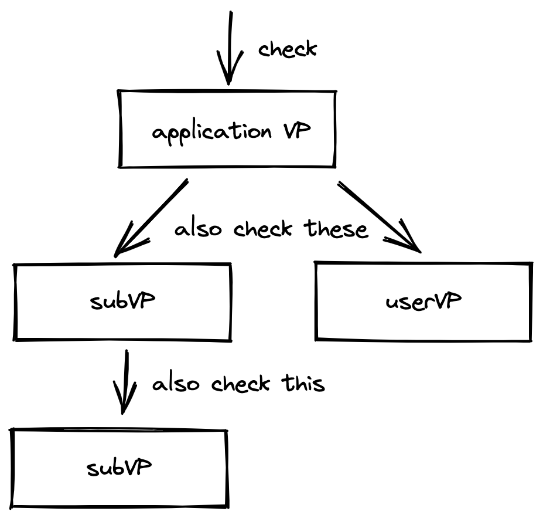

# Validity predicate (VP)

In Taiga, there are two types of mechanisms enforcing the validity of a transaction: 
* the first type is the Taiga rules that are the same for all transactions (e.g. the note must exist before being spent).
* the second type is called **validity predicates**. The choice of VPs to be checked to validate a transaction depends on the applications involved in the transaction.

A **validity predicate** is a piece of code defined by an application that authorizes transactions the application is involved in.  A valid (can be published on the blockchain) transaction satisfy the VPs of all involved applications.

A single transaction that changes the state of two applications has to be:
* checked against the Taiga rules
* checked against the VP of the first application
* checked against the VP of the second application

Every VP is called **once** per transaction to validate the state transition (e.g. if the state of the same app changes twice within one transaction, the `appVP` is called only once and is checking the total state transition).

#### Examples
- white list VP allows only specific users to change the application state
- lower bound VP restricts the smallest amount of asset that can be received

### Hierarchical VP structure
Validity predicates in Taiga have a hierarchical structure. For all applications involved in a transaction, their `ApplicationVP` must be checked. 
These VPs might require validity of some other VPs in order for a transaction to be considered valid. 
In that case, those other VPs must be checked too.

Hierarchical structure of VPs might come in handy in the situations where the application wants to enforce different checks depending on the use case. 
One example of it could be applications that have users and allow them to have `userVP`s. 
The application VP will enforce checking the userVP of each user involved in the transaction.

### Transparent vs schielded VPs
Validity predicates can be both transparent and shielded. Transparent VPs are represented as WASM code and publicly visible, shielded VPs are represented as arithmetic circuits hidden under ZKPs.
Each transaction in Taiga has VP proofs attached to it, and whoever has the verifying key (VK), can verify the proofs.

Taiga uses the Halo2 proving system and validity predicates are represented as [PLONKish circuits](https://zcash.github.io/halo2/concepts/arithmetization.html). For privacy reasons, all Taiga VPs share the same PLONK configuration (the set of building blocks available for the circuits), and distinct VPs are created by specifying the *selectors* (which blocks to use).

TODO: add selector quick explanation 

### VP interface

All validity predicates share the same *public input interface*, but can have different *private* inputs.

#### Public Inputs

* $\{nf_i\}$ - the set of revealed nullifiers in the transaction
* $\{cm_i\}$ - the set of new note commitments created in the transaction
* $e$ - the current Taiga epoch (used for time-tracking)

#### Private inputs

While not formally required, most validity predicates are expected to have all spent notes (representing the current state) and output notes (representing the next proposed state) as private input to verify that the state transition is allowed.

